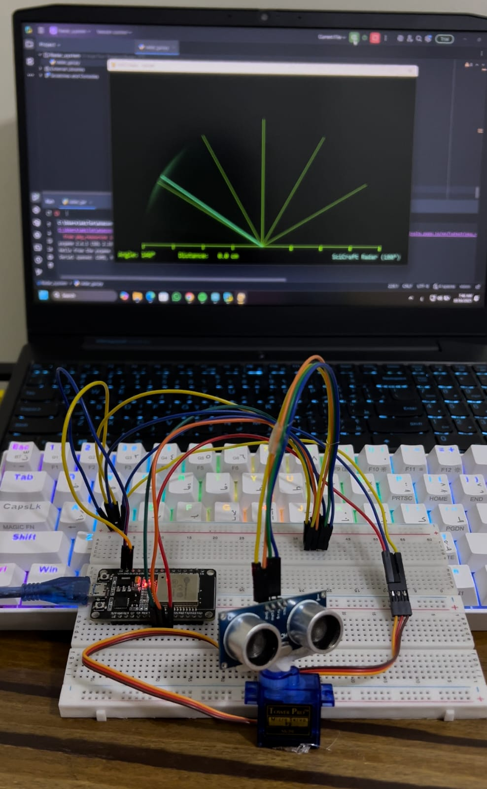

# 💡 IoT Smart Radar System


A professional **real-time radar visualization system** using **ESP32**, **Ultrasonic Sensor**, and **Servo Motor**, visualized through a smooth **Python (Pygame)** interface.  
The radar scans the surrounding area (0°–180°) and detects nearby objects with distance labels in centimeters.

---

## 🛰️ System Overview

[ **Ultrasonic Sensor + Servo Motor (ESP32)** ] ⇄ [ **Serial Communication** ] ⇄ [ **Python Pygame GUI** ]

* **Servo Motor:** Sweeps the radar from 0° → 180° → 0°  
* **Ultrasonic Sensor:** Measures distance at each angle  
* **Python GUI:** Displays smooth radar animation with detected points and distances  

---

## ⚙️ Hardware Components

| Component | Description |
|------------|-------------|
| ESP32 | Wi-Fi + Serial capable microcontroller |
| Ultrasonic Sensor (HC-SR04) | Measures distance to objects |
| Servo Motor (SG90 / MG90S) | Rotates the sensor between angles |
| Jumper Wires | Used for connections |
| Breadboard | Optional for prototyping |
| USB Cable | For serial connection to PC |

---

## 🪛 Circuit Connection

| ESP32 Pin | Component | Function |
|------------|------------|-----------|
| GPIO5 | TRIG | Ultrasonic trigger pin |
| GPIO18 | ECHO | Ultrasonic echo pin |
| GPIO19 | Servo Signal | Servo control |
| 5V | VCC | Power supply |
| GND | GND | Common ground |

> ⚠️ **Note:** Always power the servo motor from a stable 5V source.  
> Avoid drawing high current directly from the ESP32 3.3V pin.

---

## 🧩 Software Setup

### 1️⃣ ESP32 Arduino Code

* Open `ESP32_Code/radar_system.ino`
* Upload using **Arduino IDE** with board type **ESP32 Dev Module**
* Ensure correct **COM Port** is selected
* The ESP32 continuously sends serial data in the format:
  ```
  angle,distance.
  ```

### 2️⃣ Python Visualization Script

* Install dependencies:

```bash
pip install pygame pyserial
```

* Update your COM port inside the script (example: `COM5` on Windows):

```python
COM_PORT = "COM5"
```

* Run the script:

```bash
python radar_gui.py
```

> ✅ The GUI will show a **real-time 180° radar** with smooth scanning and distance display for detected objects.

---

## 📡 System Behavior

| Component | Action |
|------------|---------|
| Servo Motor | Sweeps from 0° → 180° → 0° continuously |
| Ultrasonic Sensor | Measures distance at each angle |
| Python GUI | Displays radar beam, detected points, and distances |
| Serial Communication | Transfers data between ESP32 and PC |

---

## 📊 Data Format

The ESP32 sends data to Python in this format:
```
angle,distance.
```

Example:
```
90,23.50.
```

Python parses these values to plot each point dynamically on the radar.

---

## 🔒 Notes & Recommendations

* Always check your **COM port** before running the Python script.  
* If the servo jitters, consider adding a **1000 µF capacitor** between 5V and GND.  
* You can adjust the `MAX_RANGE_CM` in the Python file to match your sensor’s effective range (e.g. 50 cm).  
* Do not commit any sensitive data (serial ports, credentials) to public repos.

---

## 🧠 Future Improvements

* Add **real-time object tracking trails** with fading effects.  
* Use **Wi-Fi communication** instead of serial.  
* Add **sound alerts** when an object gets too close.  
* Create a **3D radar view** using OpenGL or Processing.

---

## 📜 License

This project is licensed under the **MIT License** — see the `LICENSE` file.

---

### 👨‍💻 Developed by weLTon  

✨ "Scanning the world, one sweep at a time."

---

## 📸 Project Demonstration

### 🔹 Radar Scanning in Action

Smooth radar sweep from 0°–180° showing detected objects in real time.



### 🔹 Real-Time Object Detection

Detected points appear as red glowing dots with distance labels.


---

✨ **Fully synchronized — from ESP32 hardware to Python visualization!**
